# 🏴‍☠️ AWS-CYBERSECURITY-SIEM 🏴‍☠️

An advanced CyberSecurity SIEM/XDR solution designed for AWS Organizations with a multi-account architecture. This project is deployed using Infrastructure as Code through AWS CDK, integrating the powerful OpenSource Wazuh platform to enhance protection, monitoring, and security best practices for cloud-native workloads.

> I developed this as part of my CyberSecurity Master's Thesis, and now, this solution also safeguards my personal workloads!

## Complete Thesis PDF

If you want to dive deeper into the project, you can read the PDF for the Master's Thesis Project here:

- [TFM_SANTIAGO_GARCIA_ARANGO_SIEM_AWS.pdf](./TFM_SANTIAGO_GARCIA_ARANGO_SIEM_AWS.pdf)

## General Architecture

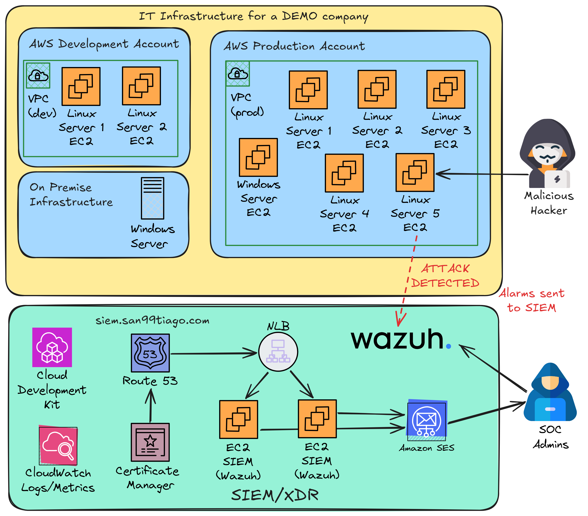  

## Abstract (Thesis project)

This master's project aims to implement a distributed SIEM system on Amazon Web Services (AWS) cloud architectures, using Wazuh as the primary tool for monitoring, protection, and security. Through the adoption of cloud security best practices, a multi-account organizational setup in AWS was designed to separate critical business areas, supported by a secure and adaptable network infrastructure. The project included deploying multiple workflows simulating business workloads and monitoring them through the SIEM, with customized configurations and advanced rules to detect and respond to cyberattacks. The solution was implemented following an "Infrastructure as Code" approach using AWS CDK, ensuring efficient and scalable management. Multiple scenarios were conducted to validate the system’s ability to identify vulnerabilities and generate proactive responses to threats, thus fulfilling the established objectives.

**Keywords**: AWS, SIEM, Wazuh, cloud security, AWS CDK, cybersecurity, Infrastructure as Code.

## Network Architecture

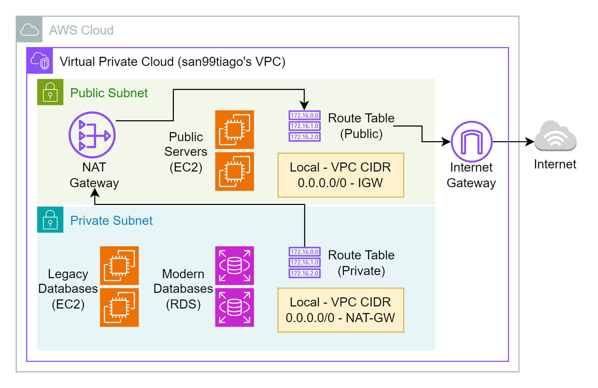  

## SIEM Architecture

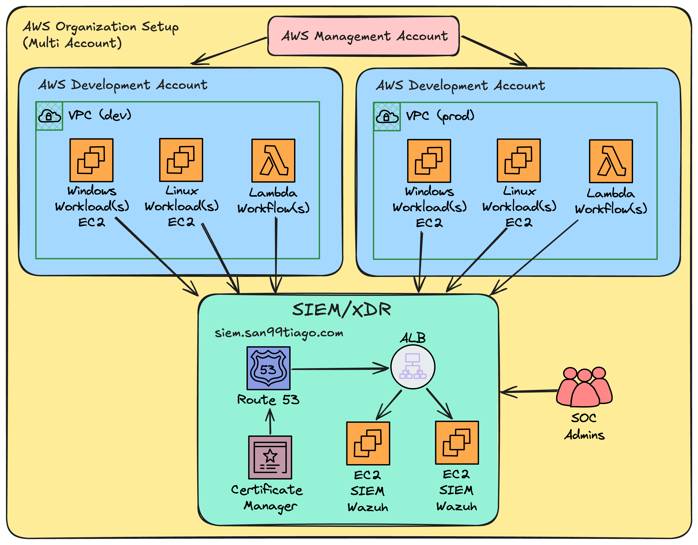  

## Demo Attack to show SIEM's Capabilities

The following images and steps will show a demo simulated attack (brute force) with Hydra, and how the SIEM is able to actively detect it and suggest remediation actions.  

First of all, the simulated attack scenario can be shown as follows:

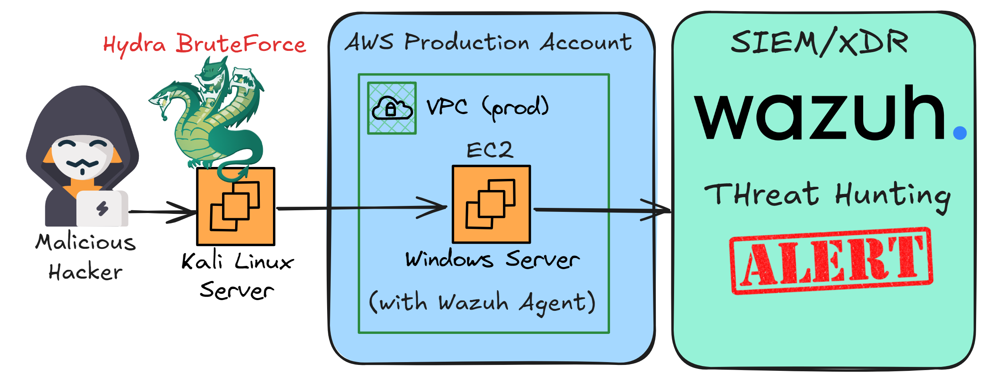  

The required resources to be executed are the network configuration and the servers:

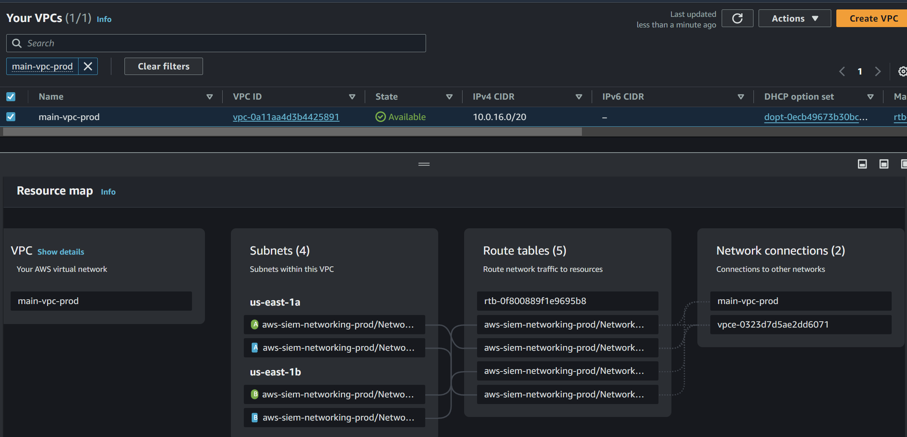  

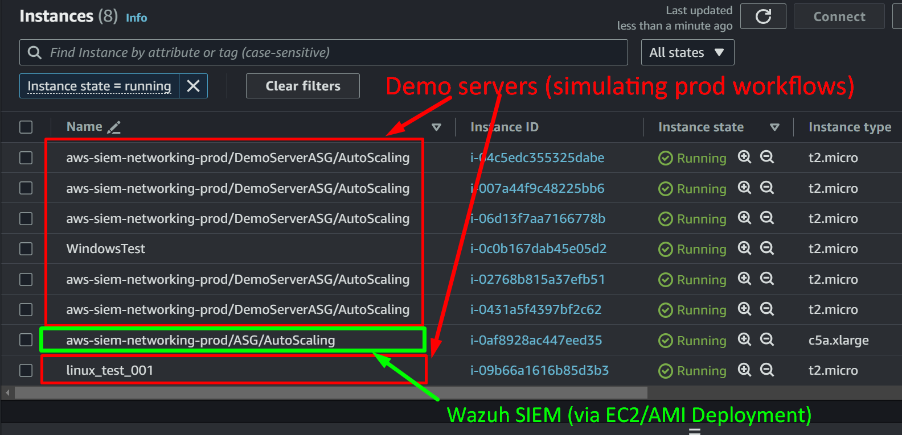  

As soon as the SIEM is deployed via CDK, we should be able to see the SIEM's custom DNS in place, pointing to the Wazuh Dashboard service. See following images:

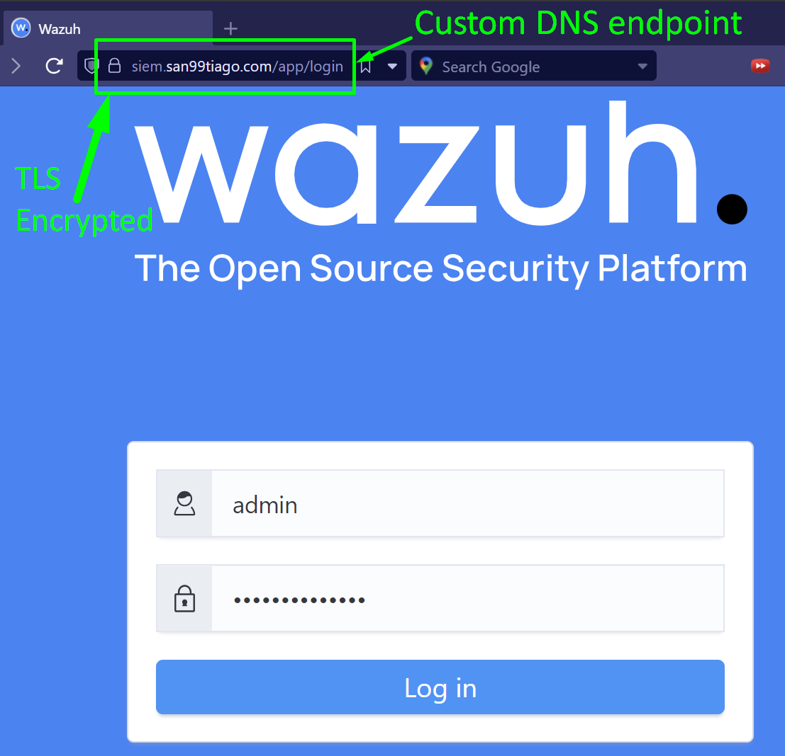  

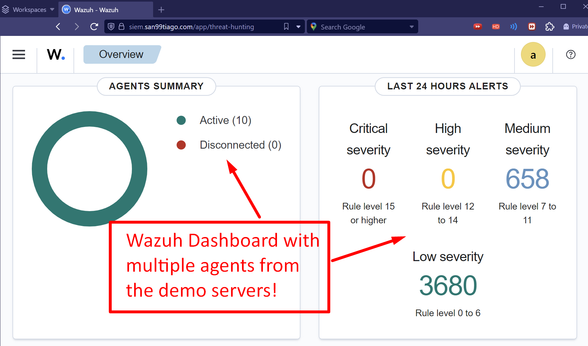  

Wazuh is able to provide initial vulnerabilities across all the servers and agents:

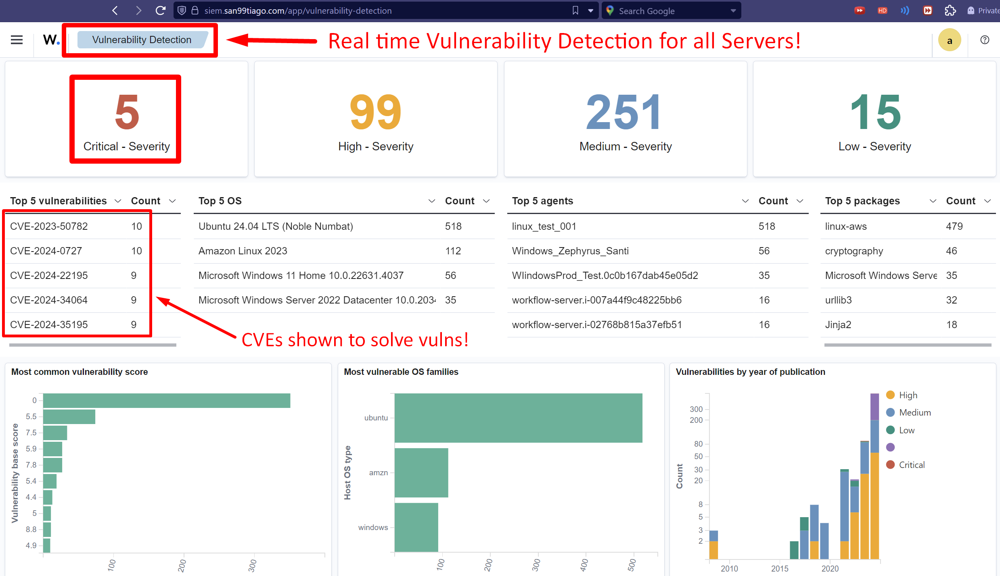  

Now, the attack is started by the malicious hacker with Hydra brute-force approach:

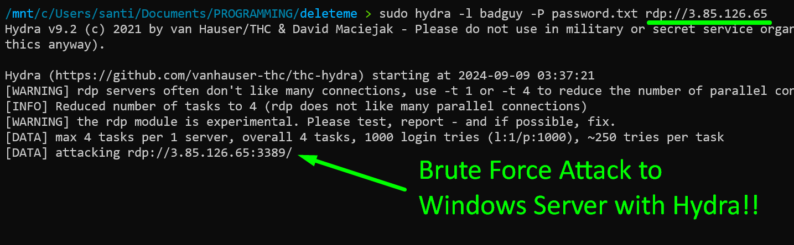  

Then, we can see how the SIEM is able to actively detect and suggest remediation actions for the attack:

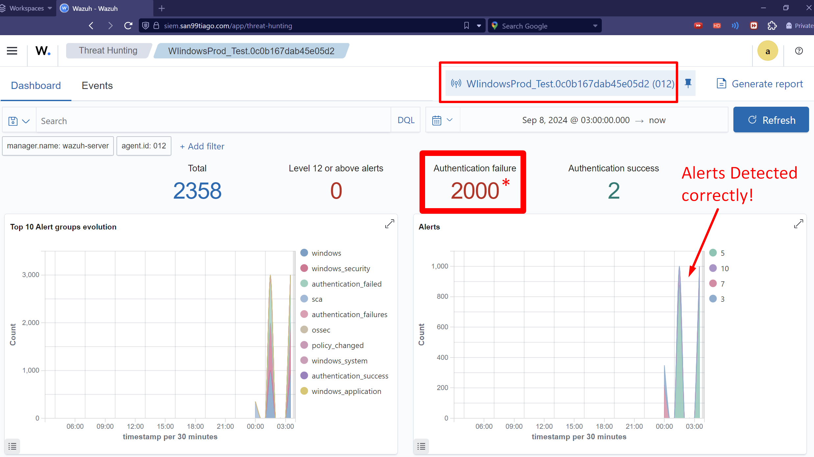  

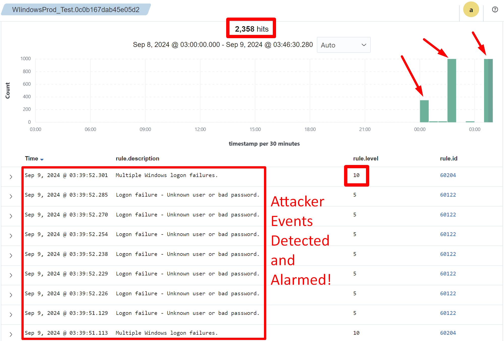  

## Author 🎹

### Santiago Garcia Arango

<table border="1">
    <tr>
        <td>
            
Curious DevSecOps Engineer passionate about advanced cloud-based solutions and deployments in AWS. I am convinced that today's greatest challenges must be solved by people that love what they do.

        </td>
        <td>
            

        </td>
    </tr>
</table>

## LICENSE

Copyright 2024 Santiago Garcia Arango.
