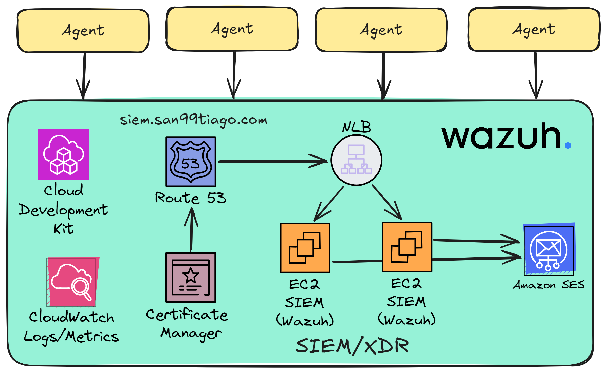

# 🏴‍☠️ AWS-CYBERSECURITY-SIEM 🏴‍☠️

An advanced CyberSecurity SIEM/XDR solution designed for AWS Organizations with a multi-account architecture. This project is deployed using Infrastructure as Code through AWS CDK, integrating the powerful OpenSource Wazuh platform to enhance protection, monitoring, and security best practices for cloud-native workloads.

> I developed this as part of my CyberSecurity Master's Thesis, and now, this solution also safeguards my personal workloads!

## Architectures

### SIEM/XDR Architecture

  

## WIP: Still in development

### Santiago Garcia Arango

<table border="1">
    <tr>
        <td>
            
Curious DevSecOps Engineer passionate about advanced cloud-based solutions and deployments in AWS. I am convinced that today's greatest challenges must be solved by people that love what they do.

        </td>
        <td>
            

        </td>
    </tr>
</table>

## LICENSE

Copyright 2024 Santiago Garcia Arango.
